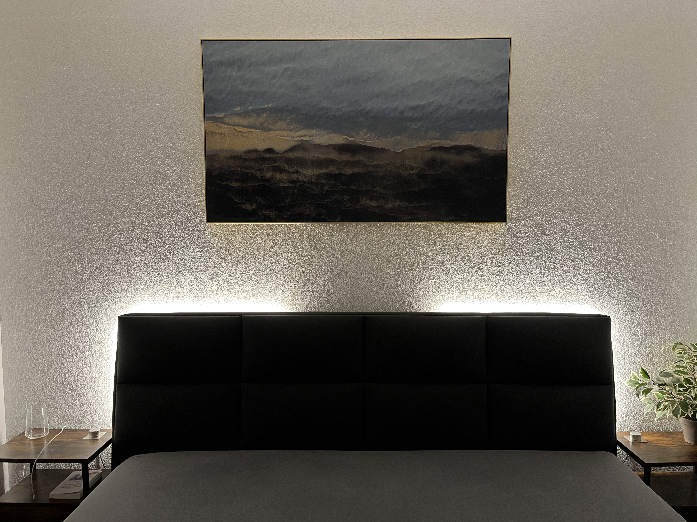

# NIGHT-LIGHT-UINO

## Intro
A DIY night light for my bedroom using an Arduino as the processing unit, 2 LED strips for illumination which are individually controlled by one potentiometer each.

Two LED strips are used to separate them into a left and right side so that me and my wife have our own separate light source which won't affect the other as much. 
They are hidden behind the corners of our beds backboard and are only visible when turned on. 
By turning the potentiometer the user can adjust the brightness.

## Hardware

### Lightstrips
I'm using SK6812 LEDs because they can provide a quality warm white light effect. 
Each strip is 1 meter long and is encased in its own diffuser channel. 
With the diffuser, the LEDs are blended into one continuous light bar instead of seeing them individually, which gives them a more pleasing look. 
To further avoid seeing individual LEDs, I choose a LED density of 144 LEDs / meter. 
To make the strips go around the corner of the backboard, the diffuser channels are bended into an "L" shape.

Strips -> `SK6812, 144/m, IP30, 1m, white pcb`

Diffuser -> `Paulmann 78902 Profile Base with White Diffuser 1m LED Channels Black Strips Aluminium Plastic Stripe`

### Potentiometers
Special 5 pin potentiometers are used which have an integrated "twist switch" causing it to "click" when the user starts turning, giving the user a more haptic feedback. 
I choose an aluminium knob for the premium feel. 
To make everything even more elegant and minimalistic, I integrated the potentiometers into the surface of the nightstand using a square aluminium plate as the surface mount.

Potentiometer -> `Taiss 10K ohm potentiometer single line cone dimmer with switch`

Knob -> `HiFi Lab Pot Knob Aluminium 38 x 22 mm Solid Silver 6 mm`

Potentiometer Plate -> `60 x 60 mm Aluminium Blech AlMg3 (5754 - Foliert)`

### TRRS Connections
An important requirement of this project was to make everything modular in order to attach / detach every component to or from the Arduino without soldering. 
This allows me to:
- disconnect the potentiometers so I can move the nightstand while cleaning
- disconnect the LEDs for maintainance or replacement
- disconnect the Arduino for reprogramming or debugging

To implement this requirement I choose TRRS cables and connectors because they had the right amount of pins and are easy to solder. Such TRRS are also convinient because they can cover longer distances than usual jumper cables and are more protected.

Connectors -> `InduSKY 3.5mm Mini Stereo Jack Plug with Nuts 4 Pin Fully Gold Plated`

Cables -> `Goobay 63828 AUX cable, 3.5mm jack plug (4-pin, stereo), 1.5m`

### Micro Controller
As the micro controller I choose an Arduino Nano Every because it should be small enough to fit in the case. Since it has no header pins soldered to it, it also has a smaller footprint on the PCB. 

The Arduino and the lightstrips are powered by a single 5V/10A power supply. 
To easily disconnect it from the power source, a female VCC jack is soldered on. 
The original male VCC plug was not fitting tight (2.5mm instead of 2.1mm) so I had to resolder a smaller male plug to it.

Power Supply -> `LEICKE Ull Universal Power Supply, 5V/ 10A 50W, 5.5 x 2.5 mm Plug`

Female VCC Jack -> `DC Power Jack Socket 55 x 21 mm`

Case -> `Plastic Junction Box for Electronics, Black, 100 x 60 x 25 mm`

I/O-Switch -> `Rocker Switch Button, Round, Black`

### Wiring Overview

### TRRS Connector Wiring

### PCB Layout

## Software

### Animation
I added some animations to justify using an Arduino and adressable LED strips. To controll / animate the LED strips, the `Adafruit Neopixel` Library is used.
The animation can be broken down into separate stages, depending on the position of the potentiometer:

`Stage 1 - Click On`: 
When the potentiometer is being turned from its starting position to the right, it will "click". 
At this point every LED on the strip will be turned on to a low brightness.

`Stage 2 - Brightness Control`: 
If the user keeps on twisting the potentiometer after the click, a "walking light" effect will be visible. 
The walking light is a new layer of brightness on top of the low brightness. 
The position of the potentiometer will dictate how much of the strip will be with high brightness level. 
For example, if the potentiometer is fully turned to the right, the strip / every LED will be at full brightness. 
To make the animation more komplex and interesting, I added a twist (pun intended) -> the "high brightness level" will increase, the more the user rotates to the right. 
If the user rotates counter clockwise, the light will "walk" back and the high brightness level will decrease. 
If the user further rotates counter clock wise, just before the click, every LED will be on low brightness level again.

`Stage 3 - Click Off`: 
When the potentiometer is being turned to the left until it clicks again, the strip will transition from low brightness to being completly switched off. The transition will happen one LED at the time, resulting in another walking effect.

https://user-images.githubusercontent.com/34677325/216823595-fa8bc0b0-e7fb-44e8-a918-d96fec7f0413.mp4

### Testing
While prototyping, I used different sketches and hardware to get to my goal. These can be found in the `tests/` folder and they include tests such as:
- Hello World rainbow effects
- Potentiometer controlling tests
- Walking effects with single LEDs
- Walking effects with LED strips
- Controlling 2 strips with one sketch
- Tests with WS2812B
- Tests with SK6812

### Main
The main sketch, which is flushed into the Arduino Nano can be found in the `main/` folder. It is the result of all the testing and debugging.

## Unresolved Issues
There is one unresolved issue for which I could not find a reliable solution yet: 
Since the position of the potentiometer gets mapped to an LED adress, it can often lead to being right between to LED adresses, causing the last LED of the "walking line" to flicker.
I have a suspicion that its because of the analogs pin noise which changes the value +/- 1.

https://user-images.githubusercontent.com/34677325/216823608-3a35e2b5-f753-4521-8440-ed8eee9c715b.mp4

## Conclusion
So this is it - an over engineered night light, because thats what I do...

Don't hesitate to improve this project ;-)
